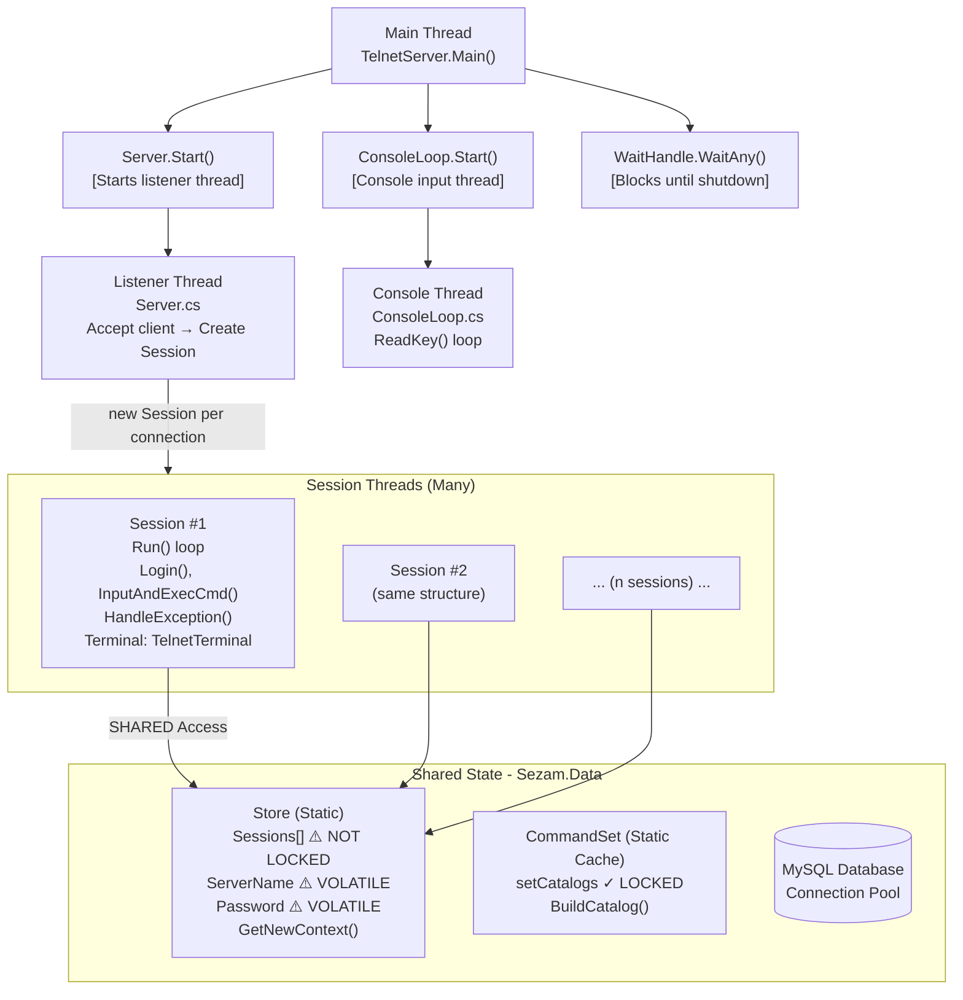
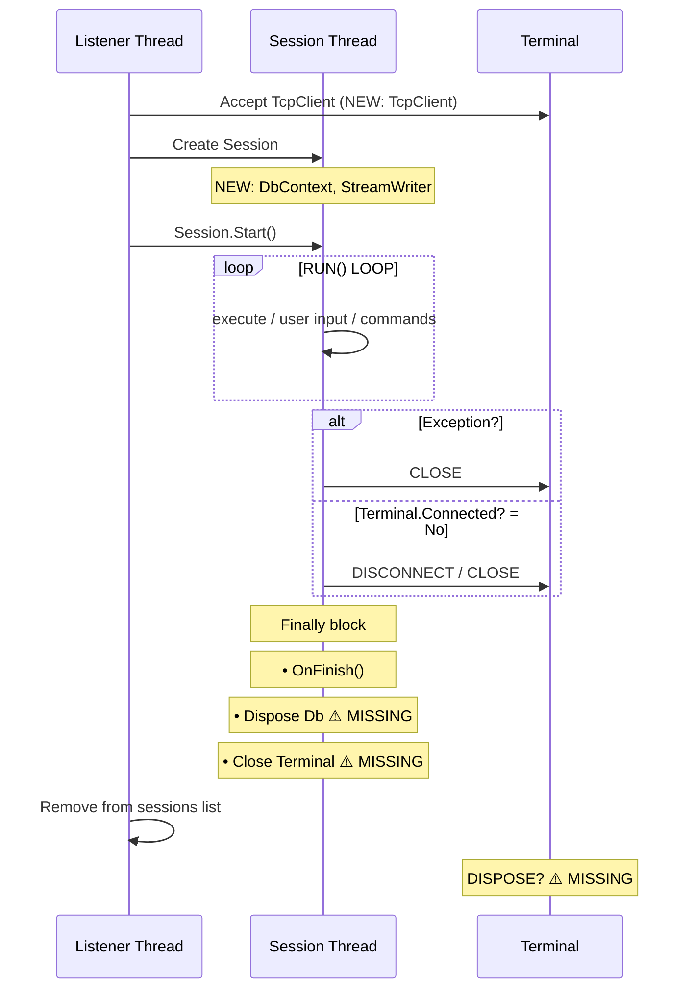
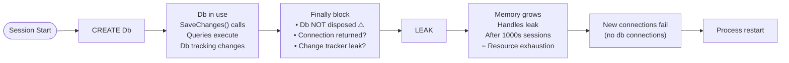
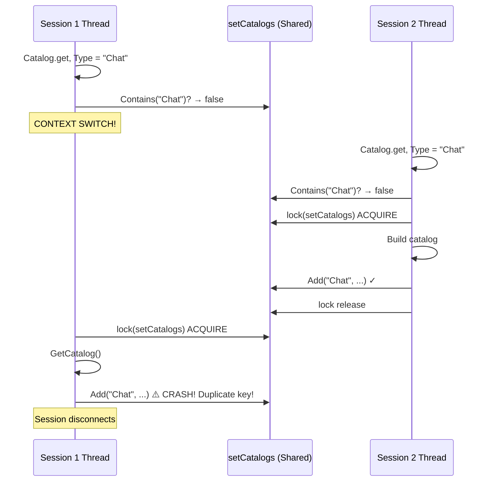
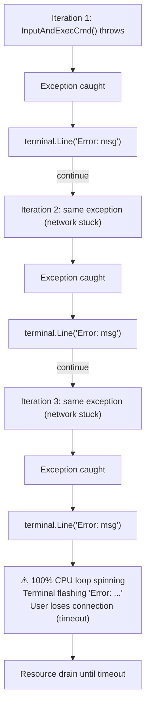
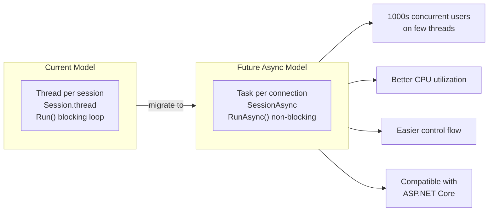

# Sezam Architecture & Threading Diagrams

## Current Threading Model



## Resource Lifecycle Diagram



## Thread Safety Matrix

| Shared State | Access Location | Lock | Status |
|---|---|---|---|
| Store.Sessions[] | Server.cs | ✓ | OK* |
| Store.ServerName | Server.cs (once) | ⚠️ | Volatile? |
| Store.Password | Server.cs (once) | ⚠️ | Volatile? |
| Session.Db | Per-session only | N/A | SAFE |
| Session.cmdLine | Per-session only | N/A | SAFE |
| Session.rootCmdSet | Per-session only | ⚠️ | Race! |
| Session.currentCmd | Per-session only | ⚠️ | Race! |
| CommandSet.Catalog | Multiple sessions | ⚠️ | BROKEN |
| Terminal.Connected | Per-session only | N/A | SAFE |
| TelnetTerminal.in* | Per-session only | N/A | SAFE |
| TelnetTerminal.tcp | Per-session & server | ✓ | OK |

\* Sessions list has race condition during concurrent .Add() and .Remove()

## Problematic Code Patterns - Sequence Diagrams

### 1. DbContext Leak (Resource)



### 2. CommandSet Catalog Race (Concurrency)



### 3. Exception Loop (Stability)



---

## Testing Strategy

### Unit Test Template

```csharp
[TestFixture]
public class SessionRobustnessTests
{
    [Test]
    public void Session_DisposesDbContextOnDisconnect()
    {
        // Arrange
        var mockTerminal = new MockTerminal();
        var session = new Session(mockTerminal);
        
        // Act
        session.Start();
        Thread.Sleep(100);
        session.Close();
        
        // Assert
        Assert.IsTrue(session.Db.IsDisposed);
    }
    
    [Test]
    public void CommandSetCatalog_ThreadSafeDuringConcurrentAccess()
    {
        // Arrange
        var session = new Session(new MockTerminal());
        var cmdSet = new TestCommandSet(session);
        var exceptions = new List<Exception>();
        
        // Act: 50 threads accessing catalog simultaneously
        var threads = Enumerable.Range(0, 50)
            .Select(_ => new Thread(() => {
                try
                {
                    var cat = cmdSet.Catalog;
                    Assert.IsNotNull(cat);
                }
                catch (Exception ex)
                {
                    lock (exceptions) exceptions.Add(ex);
                }
            }))
            .ToList();
        
        threads.ForEach(t => t.Start());
        threads.ForEach(t => t.Join());
        
        // Assert
        Assert.IsEmpty(exceptions);
    }
}

[TestFixture]
public class ServerRobustnessTests
{
    [Test]
    public void Server_HandlesMultipleSimultaneousDisconnects()
    {
        // Arrange
        var server = new Server(new ConfigurationRoot([]));
        server.Start();
        
        // Act: Create and disconnect 100 clients
        var clients = new List<TcpClient>();
        for (int i = 0; i < 100; i++)
        {
            var client = new TcpClient();
            client.Connect("127.0.0.1", 2023);
            clients.Add(client);
        }
        
        // All disconnect at once
        clients.ForEach(c => c.Close());
        
        // Assert: Server stable, no deadlock
        Thread.Sleep(2000);
        Assert.AreEqual(0, server.GetSessionCount());
        
        // Cleanup
        server.Stop();
    }
    
    [Test]
    public void Server_StopsWithTimeout_WhenSessionHangs()
    {
        // Arrange  
        var server = new Server(...);
        // Create session that hangs
        
        // Act & Assert
        var stopwatch = Stopwatch.StartNew();
        server.Stop();
        stopwatch.Stop();
        
        Assert.Less(stopwatch.ElapsedMilliseconds, 10000);  // Should timeout
    }
}
```

### Integration Test

```csharp
[TestFixture]
public class SessionIntegrationTests
{
    [Test]
    [Timeout(30000)]
    public void FullSessionLifecycle_ResourcesProperlyFreed()
    {
        // Get initial handle count
        var initialHandles = ProcessHelper.GetOpenHandleCount();
        var initialMemory = GC.GetTotalMemory(true);
        
        // Create 50 connections
        var tasks = Enumerable.Range(0, 50)
            .Select(_ => Task.Run(() => {
                var client = new TcpClient();
                client.Connect("127.0.0.1", 2023);
                Thread.Sleep(100);
                client.Close();
            }))
            .ToArray();
        
        Task.WaitAll(tasks);
        GC.Collect();
        GC.WaitForPendingFinalizers();
        
        // Verify cleanup
        var finalHandles = ProcessHelper.GetOpenHandleCount();
        var finalMemory = GC.GetTotalMemory(false);
        
        var handleDelta = finalHandles - initialHandles;
        var memoryDelta = finalMemory - initialMemory;
        
        Assert.Less(Math.Abs(handleDelta), 5, "Handle leak detected");
        Assert.Less(memoryDelta, 5_000_000, "Memory leak detected");  // 5MB
    }
}
```

### Load Test

```csharp
[Test]
[Category("Performance")]
public void Server_Handles100ConcurrentConnections()
{
    // Arrange
    var server = new Server(...);
    server.Start();
    var stopwatch = Stopwatch.StartNew();
    var errors = 0;
    var successCount = 0;
    
    // Act: Hammer server with 100 concurrent clients
    var tasks = Enumerable.Range(0, 100)
        .Select(i => Task.Run(() => {
            try
            {
                using (var client = new TcpClient())
                {
                    client.Connect("127.0.0.1", 2023);
                    var reader = new StreamReader(client.GetStream());
                    
                    // Read banner
                    var line = reader.ReadLine();
                    if (line?.Contains("Connected") ?? false)
                        Interlocked.Increment(ref successCount);
                }
            }
            catch (Exception ex)
            {
                Interlocked.Increment(ref errors);
                Debug.WriteLine($"Client error: {ex.Message}");
            }
        }))
        .ToArray();
    
    Task.WaitAll(tasks);
    stopwatch.Stop();
    
    // Assert
    Assert.AreEqual(0, errors, "Should handle all connections");
    Assert.AreEqual(100, successCount, "All clients should connect");
    Assert.Less(stopwatch.ElapsedMilliseconds, 5000, "Should complete within 5s");
    
    // Cleanup
    server.Stop();
}
```

### Stress Test (Chaos Engineering)

```bash
#!/bin/bash
# stress-test.sh - Kill/reconnect clients rapidly

PORT=2023
HOST=127.0.0.1
ITERATIONS=500

echo "Starting stress test..."

for i in $(seq 1 $ITERATIONS); do
    # Rapid connect/disconnect
    (echo "invalid"; sleep 0.01) | timeout 0.5 nc $HOST $PORT &
    
    if [ $((i % 50)) -eq 0 ]; then
        echo "Completed $i iterations..."
        # Check if server is still responsive
        timeout 1 nc -z $HOST $PORT || \
            echo "ERROR: Server not responding at iteration $i"
    fi
done

echo "Stress test complete. Checking server state..."
ps aux | grep Sezam.Telnet
```

---

## Success Criteria

### Before Fixes
- [ ] Resource leaks confirmed (handle monitor)
- [ ] Race conditions reproducible under load
- [ ] Exception loops observed

### After Fixes
- [ ] No resource leaks after 1000+ connections
- [ ] 100 concurrent connections handled cleanly
- [ ] Graceful shutdown within 5 seconds
- [ ] No exceptions during stress test
- [ ] Memory stable (±5MB tolerance)
- [ ] Handle count stable (±10 tolerance)

---

## Monitoring & Observability

### Logging Recommendations

Add context tracing:
```csharp
[AttributeUsage(AttributeTargets.Method)]
public class TraceAttribute : Attribute
{
    public static void LogEntry(string method) =>
        Trace.TraceInformation($"[ENTRY] {method}");
    
    public static void LogExit(string method) =>
        Trace.TraceInformation($"[EXIT] {method}");
}

[Trace]
public void Run()
{
    TraceAttribute.LogEntry("Session.Run");
    try { /* ... */ } 
    finally { TraceAttribute.LogExit("Session.Run"); }
}
```

### Metrics to Track

```csharp
public class ServerMetrics
{
    public static int ActiveSessionCount { get; private set; }
    public static int TotalConnectionsHandled { get; private set; }
    public static int DbContextCount { get; private set; }
    public static int ExceptionCount { get; private set; }
    public static DateTime ServerStartTime { get; private set; }
}
```

---

## Migration Path (Long Term)

Future improvement to async model:


